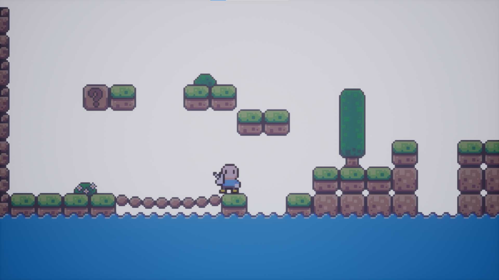

# 2D Pixel Art Game Demo

**Note:** Ignore all the pixel art importing. You can import images into the media library in the editor.

This is a prototype so it's unfinished and has no documentation.  I lost interest in it, so am putting it on here if others are interested in what approach I was taking.

It contains 2D Animator class where you pass your frames to it.  

All pixel art objects get mesh merged, so at runtime there is very few objects.

To import pixel art, I used my other [tool](https://github.com/PopThosePringles/Core-Image-To-Template).

